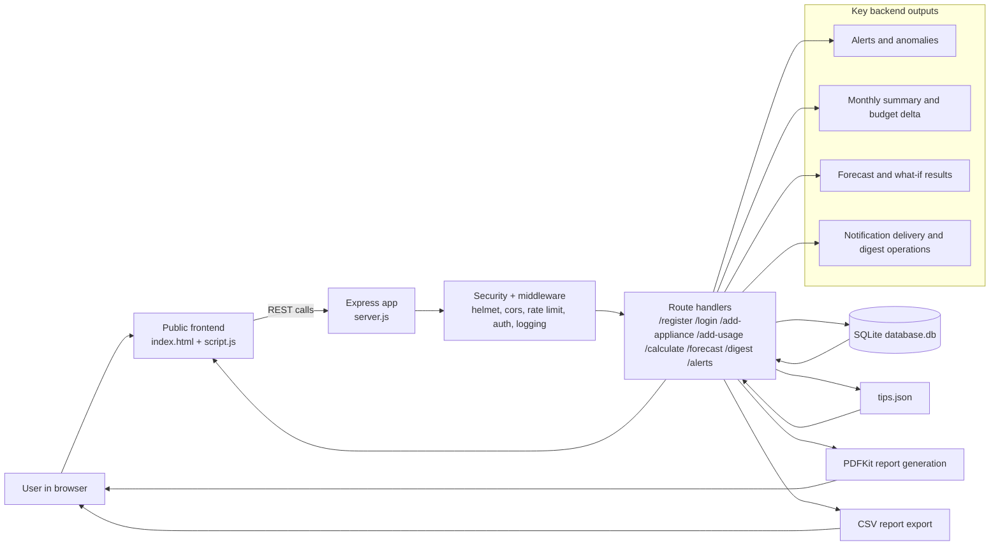
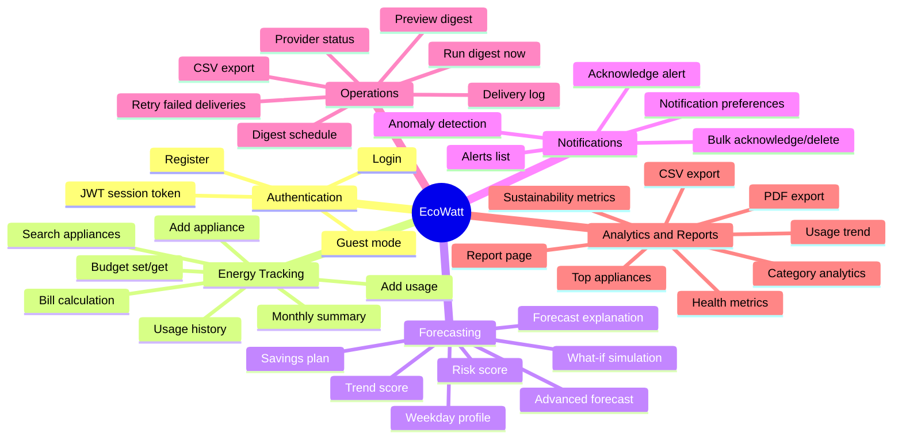
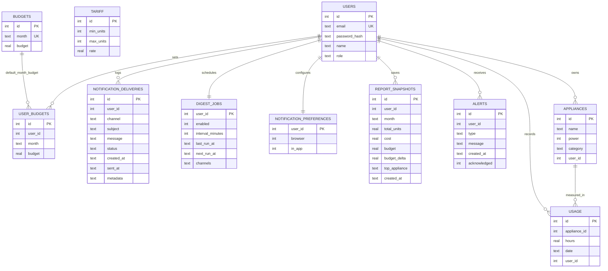

# EcoWatt Diagrams

SVG image files are ready here:

- [Architecture Diagram](diagrams/architecture.svg)
- [Data Flow Diagram](diagrams/data-flow.svg)
- [Functionality Map](diagrams/functionality-map.svg)
- [Relational Schema](diagrams/relational-schema.svg)

## 1) Data Flow Diagram

## 2) Functionality Diagram

## 3) Relational Schema Diagram

## Notes

- The schema is logical rather than strictly enforced with foreign-key constraints in SQLite.
- `user_id` is the main scoping key across the app.
- `usage.appliance_id` links usage rows to appliance rows for summaries, forecasts, and reports.